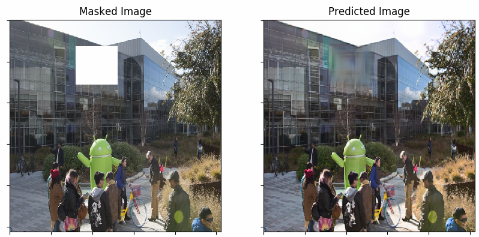
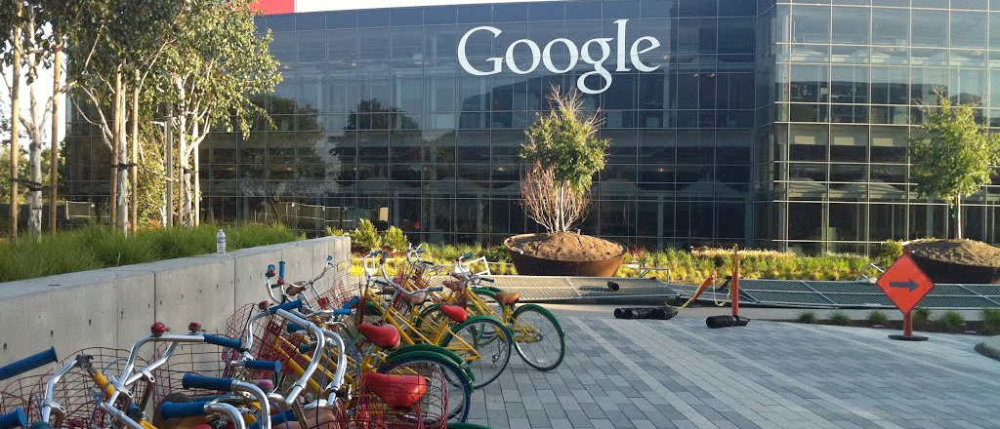

# Deep Photoshop 
<b>Deep Photoshop</b> is a tool that helps users to fill missing patches in the image.    
It is currently focussed on removing company logos.

Having ads/company logos in an image is not always desirable.   
Also, it will restrict the user to share images publicly as the company can claim copyrights for the same.   

This project is motivated by this idea to remove ads in images automatically using Deep Learning technique.   

Google slides for the project can be found [here](https://docs.google.com/presentation/d/1sWU5M_oBRgBjet9fjsCapiLf3tbw1_htFnHM6wIR26U/edit?usp=sharing)

Overview of the project:   
The aim is to remove the logo from the image.   
This happens in two major steps:     
   1. Logo Detection and then mask the logo
   2. Infill the masked part    

    
Results:    
Here are the results of the pipeline:    
The image on the left is the input image with company logo/ad. Then we have two images which after masking the logo and the one after infilling.    

 
  
 

Installation Guide:
Cloning the repo gives you the object detection and infilling model.
You also need to download the weights for Object detection and image infilling.
Both can be found [here](https://drive.google.com/drive/folders/1r7PEIqbsgZBY42kW_yIpm8Jk1hbQ8POr?usp=sharing)

After using it on a sample image with ad, following steps are to be followed:
1. Detect the logo in the image       
   cd darkent    
   ./darknet detect cfg/yolov2_logo_detection.cfg YOLOv2_logo_detection_10000th_iteration.weights /path_to_image
   cd ..       
   
2. Mask the logo
   cd PConv-Keras_KKG
   vim libs/util.py
   copy the values of Left, Top, Rght, Bottom in the file util.py     
3. Use infilling model to generate newly filled image   
   cd ..   
   python predict.py   
     
This will generate output images in the data/custom_test_images folder   
