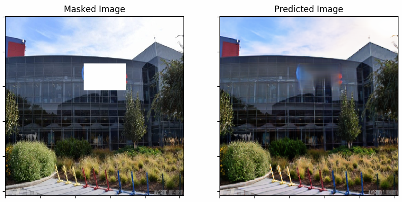
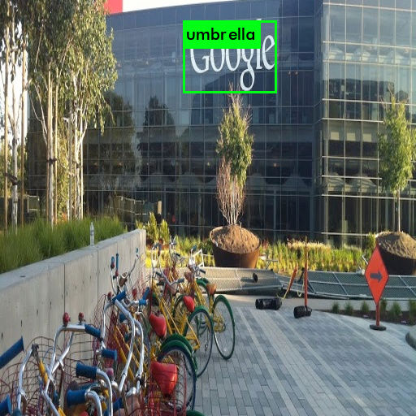
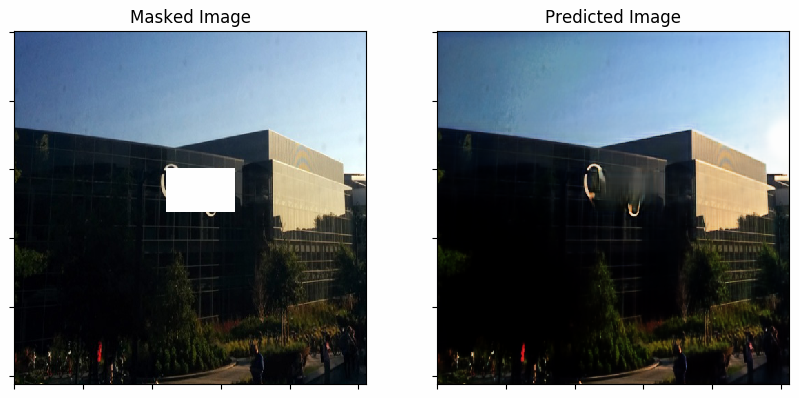

# Deep Photoshop 
<b>Deep Photoshop</b> is an image infilling model that currently focusses on removing company logos.

## Motivation
Having ads/company logos in an image is not always desirable. Also, it will restrict the user to share images publicly as the company can claim copyrights for the same. We could try to remove the logos by simply cropping the image. But if the ad is in the center of an image, this approach fails. So, hereby I created a pipeline that can remove the logo automatically from the image and replace that part with the context of the image.    
The project is thus motivated by this idea to remove ads in images using Deep Learning technique.   

Google slides for the project can be found [here](https://docs.google.com/presentation/d/1sWU5M_oBRgBjet9fjsCapiLf3tbw1_htFnHM6wIR26U/edit?usp=sharing)

## Overview of the project:   
The project aims to remove the logo from the image. This happens in two major steps:     
   1. Logo Detection and then mask the logo
         Logo detection is a YOLO model trained on Flickr 47 dataset.
   2. Infill the masked part
         Model trained on infilling random shaped mask in dataset of building images will fill the masked part
    
## Results:    
Here are the results of the pipeline:    
The image on the left is the input image with company logo/ad. Then we have two images which after masking the logo and the one after infilling.    

Let's see step wise output of the two models:

### YOLO:
Here, we identify the company logo and draw bounding box around it. We just need the co-ordinates of the box and label is not important. So need not worry about label at this point.    

### Image Infilling:
This takes the masked image and the mask as an input. As an output it gives an image after filling the gap.    

### Few more results:
 

## Installation Guide:
Cloning the repo gives you the object detection and infilling model.
You also need to download the weights for Object detection and image infilling.
Both can be found [here](https://drive.google.com/drive/folders/1r7PEIqbsgZBY42kW_yIpm8Jk1hbQ8POr?usp=sharing)

After using it on a sample image with ad, following steps are to be followed:    
0. Put the image in test_infilling and convert image in required dimensions.    
   python src/process.py /data/test_infilling/test/image_name    
1. Detect the logo in the image     
   cd darknet    
   ./darknet detect cfg/yolov2_logo_detection.cfg YOLOv2_logo_detection_10000th_iteration.weights /path_to_image    
   cd ..            
   
3. Use infilling model to generate newly filled image   
   cd ..   
   python predict.py   
     
This will generate output images in the data/custom_results folder   
